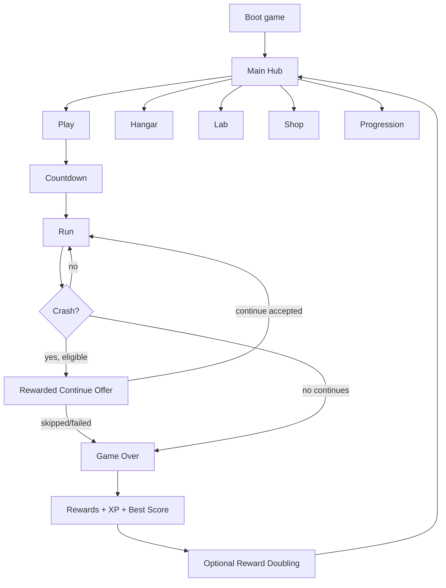

# Product Behaviour Map

## One-sentence game promise

Spin a mag craft around the inside of a glowing hex tunnel, dodge bold hazards, collect hex coins and powers, chase the bright orange core, upgrade, customise, and run again.

## Player journey

## What the player must always understand

- Where the ship is around the tunnel.
- Which tunnel segments are dangerous.
- Where the safe route is.
- What was collected.
- Which powerup is active and for how long.
- Why they crashed.
- What they earned.
- What they can improve before the next run.

## Final first-release gameplay shape

| Area | Target behaviour |
| --- | --- |
| Movement | The ship auto-runs forward and the player steers clockwise/anti-clockwise around the inside of the tunnel. |
| Tunnel | Hexagonal corridor, readable lanes/sides, glowing centre/core in the distance, clear foreground hazards. |
| Hazards | Walls, fans, lasers, and closing doors form the first meaningful obstacle roster. |
| Pickups | Hex coins are the main collectible. Powerups appear rarely and feel valuable. |
| Powerups | P0 roster: Magnet, Shield, Score Multiplier, Coin Multiplier, Pilot Assist/Rescue. |
| Scoring | Distance score plus collection/combo bonuses. Best score updates at run end. |
| Rewards | Runs grant soft currency and XP. Rewarded ads can continue or double rewards. |
| Meta | Spend rewards in Lab and Hangar. Lab owns upgrades; Hangar owns ships/cosmetics. |
| Session | One run should be understandable in the first 30 seconds and worth replaying for upgrades. |

## What is intentionally not product truth yet

These may exist in code or docs, but they should not drive the BDD unless we deliberately keep them:

- Large achievement/catalog breadth before the core run is fun.
- Deep level/route selection before one tunnel route feels great.
- SpeedBoost, SlowMo, and CoinBonanza as guaranteed first-release powerups.
- Shop complexity beyond remove ads, restore purchases, and simple currency/cosmetic purchase paths.
- Too many separate progression screens before the repeat loop is validated.

## Definition of fun-ready

The first closed-testing loop is fun-ready when a new player can:

1. Open the game.
2. Tap Play.
3. Understand movement without written explanation.
4. Dodge at least three obstacle types.
5. Collect coins and one obvious powerup.
6. Crash and understand why.
7. See meaningful rewards.
8. Spend something useful.
9. Choose to play again without being pushed by a menu maze.
