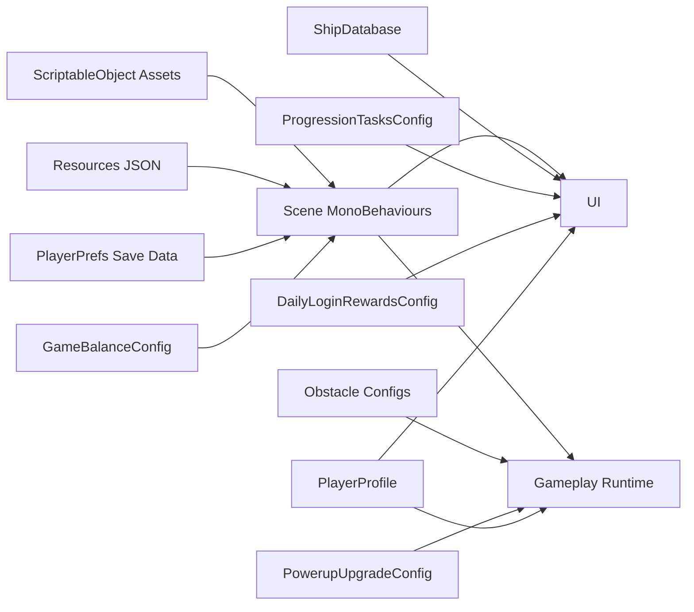

# Game Data Reference

This document maps the main gameplay and meta data surfaces in the repo, where they live, how they are edited, and what currently looks authored versus placeholder or missing.

## Quick Summary

| Area | Primary Source | Current State | How To Edit |
| --- | --- | --- | --- |
| Core balance | `Assets/Config/GameBalanceConfig.asset` | Authored | Edit in Unity Inspector |
| Track generation | `Assets/Config/TrackGenerationConfig.asset` | Authored | Edit in Unity Inspector |
| Speed scaling | `Assets/Config/SpeedScalingConfig.asset` | Authored | Edit in Unity Inspector |
| Obstacle parts/patterns | `Assets/Config/Obstacles/*.asset` | Authored | Edit in Unity Inspector |
| Ship database | `Assets/Config/ShipDatabase.asset` | Present but empty | Populate with ScriptableObjects, then wire database |
| Shop database | `Assets/Resources/ShopDatabase.asset` | Authored starter catalog | Edit in Unity Inspector |
| Player profile defaults | `Assets/Config/PlayerProfile.asset` | Present, mostly blank defaults | Edit in Unity Inspector |
| Powerup upgrades | `Assets/Config/PowerupUpgradeConfig.asset` | Present but empty | Populate with upgrade entries |
| Daily login rewards | `Assets/Resources/DailyLoginRewardsConfig.asset` | Authored and runtime-loadable | Edit in Unity Inspector |
| Progression tasks | `Assets/Resources/ProgressionTasksConfig.asset` | Populated with sample/static data and runtime-loadable | Edit in Unity Inspector |
| IAP catalog | `Assets/Resources/IAPProductCatalog.json` | Placeholder/empty | Replace with real catalog or rely on scene product list |
| Remove Ads IAP | `RemoveAdsIAPManager` scene component | Implemented in code | Edit scene component product list |
| Settings | `PlayerPrefs` via `SettingsData` | Implemented | Change defaults in code, runtime values via UI |
| Ads flags | `PlayerPrefs` via `AdsConfig` | Implemented | Runtime only unless reset in prefs |

## Data Flow

## 1. Core Balance

### File

- `Assets/Config/GameBalanceConfig.asset`

### Used By

- `RunScoreManager`
- `RunCurrencyManager`
- `PlayerPowerupController`
- `GameManager`

### What It Controls

- Player health and side scrape damage
- Score growth and combo behavior
- Pickup and powerup spawn chance defaults
- Powerup durations and strengths
- Upgrade scaling hooks
- Continue limits and respawn behavior

### Current Observed Values

- `maxHealth: 1`
- `pickupBaseScore: 10`
- `powerupSpawnChance: 0.15`
- `maxContinuesPerRun: 3`

### How To Modify

1. Open `GameBalanceConfig.asset` in Unity.
2. Change numbers in the Inspector.
3. Play the game and validate scoring, pickup density, and continues.

### Risks

- These values feed multiple systems. A small balance change can affect score pacing, ad continues, run reward payouts, and powerup feel.

## 2. Track Generation

### Files

- `Assets/Config/TrackGenerationConfig.asset`
- `Assets/Config/SpeedScalingConfig.asset`

### What They Control

- Tunnel segment length, incline, recycling
- Forward speed curve
- Combo-based speed bonus

### Current Observed Values

- Track segment length: `12`
- Height per segment: `0.5`
- Base speed: `40`
- Max speed: `120`

### How To Modify

1. Edit the asset in Unity.
2. Test a full run for camera comfort, obstacle readability, and pickup timing.

## 3. Obstacle Parts and Pattern Data

This is the closest thing in the current repo to configurable "parts" for the run.

### Files

- `Assets/Config/Obstacles/*.asset`
- Example: `Assets/Config/Obstacles/Doors_Config.asset`

### Used By

- `ObstacleRingGenerator`

### What It Controls

- Which obstacle prefab is spawned
- Which obstacle type it represents
- Which difficulty bands can use it
- How many times a pattern can repeat
- How far the ring rotates between repeats
- Rotation direction rules
- Min/max spin speed

### Current Observed State

- Multiple obstacle config assets exist.
- `Doors_Config.asset` is authored with three difficulty bands.
- The runtime generator supports weighted variation by difficulty band.

### How To Modify

1. Open an obstacle config asset in Unity.
2. Adjust `difficultyConfigs`.
3. If you need a new obstacle family, duplicate an existing asset and swap `ringPrefab`.
4. Confirm the prefab has the expected obstacle controller and visuals.

### Important Note

- Changing obstacle config data changes what can spawn in the run, but only for configs actually assigned on the `ObstacleRingGenerator` in the scene.

## 4. Ships, Cosmetics, and Hangar Data

### Code Types

- `ShipDefinition`
- `ShipUpgradeDefinition`
- `ShipSkinDefinition`
- `ShipTrailDefinition`
- `ShipCoreFxDefinition`
- `ShipDatabase`

### Files

- `Assets/Scripts/UI/MainMenu/MainMenuData.cs`
- `Assets/Config/ShipDatabase.asset`

### Current Observed State

- `ShipDatabase.asset` exists but all arrays are empty:
  - `ships`
  - `upgrades`
  - `skins`
  - `trails`
  - `coreFx`

### What This Means

- Hangar UI code exists.
- Cosmetic and upgrade item view code exists.
- The authored content layer is not populated yet in the checked-in database asset.

### How To Add Content

1. Create the needed ScriptableObject assets from the Unity Create menu:
   - `Main Menu/Ship Definition`
   - `Main Menu/Ship Upgrade Definition`
   - `Main Menu/Ship Skin Definition`
   - `Main Menu/Ship Trail Definition`
   - `Main Menu/Ship Core FX Definition`
2. Fill in IDs, names, icons, prices, prefabs, and stats.
3. Add those assets into `Assets/Config/ShipDatabase.asset`.
4. Verify the scene's `HangarPageController` references that database.

### ID Rules

- `PlayerProfile` unlocks and equips cosmetics by string ID.
- Do not casually change IDs after release. Old saved profiles would stop matching unlocked or equipped items.

## 5. Upgrade Data

There are two upgrade systems in the repo.

### A. Ship/Hangar Upgrades

Defined by:

- `ShipUpgradeDefinition` assets inside `ShipDatabase`

Fields:

- `upgradeType`
- `displayName`
- `icon`
- `maxLevel`
- `baseCost`
- `costIncrease`

Cost formula:

- `baseCost + costIncrease * currentLevel`

Stored in save data:

- `PlayerProfile.upgradeLevels`

### B. Powerup Upgrades

Defined by:

- `Assets/Config/PowerupUpgradeConfig.asset`

Fields per entry:

- `powerupType`
- `displayName`
- `icon`
- `baseCost`
- `costIncrease`
- `levels[]`

Fields per level:

- `duration`
- `strength`

Current state:

- Asset exists, but `upgrades: []`

How to add:

1. Open `PowerupUpgradeConfig.asset`.
2. Add one entry per powerup type you want upgradeable.
3. Add a `levels` array for each entry.
4. Verify `HangarPageController` shows them in the Upgrades tab.
5. Verify `PlayerPowerupController` reads the upgraded tuning in play mode.

## 6. Powerup Runtime Data

### Code

- `PlayerPowerupController`
- `PowerupType`
- `PowerupEntry`

### Sources

- Default tuning comes from `GameBalanceConfig`
- Optional per-level overrides come from `PowerupUpgradeConfig`
- Spawn chance also comes from runtime generator settings and balance config

### Powerups Observed In Code

- AutoPilot
- CoinMultiplier
- ScoreMultiplier
- Magnet
- Shield
- CoinBonanza
- SpeedBoost
- SlowMo

### Important Note

- If `PowerupUpgradeConfig` is empty, all powerups still work. They just use base balance values only.

## 7. Shop Data

### Code Types

- `ShopItemDefinition`
- `ShopDatabase`

### Used By

- `ShopPageController`
- `ShopItemCardView`
- `ShopItemDetailsModal`

### Current Observed State

- Shop UI code exists.
- No authored `ShopDatabase.asset` was found in the repo scan.

### What This Means

- The Shop page likely needs either:
  - a missing asset that was not committed, or
  - scene references still to be confirmed, or
  - future authoring work before the page is functional.

### How To Add It

1. Create `Shop Item Definition` assets.
2. Create a `Shop Database` asset.
3. Populate tab arrays:
   - `skinItems`
   - `shipItems`
   - `trailItems`
   - `currencyItems`
4. Assign the database to `ShopPageController`.

## 8. Player Profile and Save Data

### Asset

- `Assets/Config/PlayerProfile.asset`

### Runtime Persistence

- Saved to `PlayerPrefs` under:
  - `PlayerProfile`
  - `PlayerProfileHash`

### What It Stores

- Level and XP
- Soft and premium currency
- Selected ship
- Selected skin / trail / core FX
- Unlocked item IDs
- Ship upgrade levels
- Powerup upgrade levels

### Current Observed Defaults

- `level: 1`
- `softCurrency: 0`
- `premiumCurrency: 0`
- No selected items
- No unlocked items

### How To Modify

- For design defaults: edit the asset in Unity.
- For live testing of save behavior: clear or change `PlayerPrefs`.

### Warning

- This asset is only the starting/default state. The live state is stored in `PlayerPrefs` once the game runs.

## 9. Daily Login Rewards

### Code

- `DailyLoginRewardsConfig`
- `DailyLoginRewardsManager`
- `DailyLoginRewardPreviewView`

### Reward Types Supported

- Soft currency
- Premium currency
- Skin
- Item

### Current Observed State

- The config asset exists at `Assets/Resources/DailyLoginRewardsConfig.asset`.
- The manager exists.
- The preview UI exists.
- The runtime flow can now resolve the config through `Resources` when the scene reference is not serialized yet.

### What This Means

- The system is implemented structurally and now has checked-in authored content.
- If the manager is missing both a scene reference and the `Resources` asset, the preview will show "Rewards unavailable."

### How To Add It

1. Edit `Assets/Resources/DailyLoginRewardsConfig.asset`.
2. Set `defaultSoftCurrencyAmount`.
3. Add special rewards for milestone days.
4. Optionally still assign the asset directly to the `DailyLoginRewardsManager` in-scene for explicit wiring.
5. Confirm item reward IDs match unlockable item IDs in profile/shop/hangar data.

### Persistence Keys

- `DailyLogin.LastClaimDate`
- `DailyLogin.DayIndex`

## 10. Progression Tasks (Daily / Weekly / Monthly)

### Asset

- `Assets/Resources/ProgressionTasksConfig.asset`

### Used By

- `ProgressionTasksController`
- `ProgressionTasksHubView`

### Current Observed State

- Asset exists and is populated.
- Data currently looks static/sample rather than live-driven.
- Icons are mostly null.
- Daily, weekly, and monthly groups reuse similar example tasks.

### Current Example Data

- Daily points: `120 / 300`
- Weekly points: `480 / 1200`
- Monthly points: `900 / 2400`
- Example tasks:
  - `Complete 3 runs`
  - `Travel 2,000m`
  - `Finish a run without crashing`

### How To Modify

1. Open `ProgressionTasksConfig.asset`.
2. Edit each cadence group.
3. Update:
   - points totals
   - timers
   - reward nodes
   - task rows
   - icons
4. If this should become a real progression backend/system, replace static values with runtime-fed data instead of hand-editing current progress.

### Current Limitation

- The config stores both definitions and current progress in the same asset. That is fine for mock content, but not ideal for live player progression.

## 11. IAPs and Monetisation

### Files / Code

- `Assets/Scripts/Monetisation/RemoveAdsIAPManager.cs`
- `Assets/Scripts/Monetisation/AdsConfig.cs`
- `Assets/Resources/IAPProductCatalog.json`
- `Assets/Resources/BillingMode.json`

### Current Observed State

- `RemoveAdsIAPManager` is implemented.
- Hardcoded primary product constant is `premium_user`.
- The JSON product catalog currently contains a placeholder empty product.
- Ads removal state is stored in `PlayerPrefs`.

### Important Detail

- Actual store products may be coming from the `products` array on the `RemoveAdsIAPManager` scene component, not from the JSON catalog.

### How To Modify

For Remove Ads:

1. Open the scene object with `RemoveAdsIAPManager`.
2. Update the serialized `products` list.
3. Ensure the store ID matches the product configured in Google Play / App Store.

For the catalog file:

1. Replace placeholder entries in `Assets/Resources/IAPProductCatalog.json`.
2. Confirm whether any runtime code actually reads that file before relying on it.

### Persistence

- `AdsConfig.RemoveAds`
- `AdsConfig.InterstitialsEnabled`

## 12. Settings Data

### Code

- `Assets/Scripts/Settings/SettingsData.cs`
- `Assets/Scripts/UI/SettingsMenuUI.cs`

### Stored In PlayerPrefs

- Music volume
- SFX volume
- Vibration enabled
- Touch input mode
- Touch sensitivity
- Run sensitivity

### Current Defaults

- Music volume: `0.8`
- SFX volume: `1.0`
- Vibration: on
- Touch mode: `Drag`

### How To Modify

- Change code defaults in `SettingsData` for new installs.
- Use the Settings UI to change runtime values for a device profile.

## 13. Things To Confirm

These are the most important data questions still open after scanning the repo:

- Is there an uncommitted or external `ShopDatabase.asset`?
- Is there a `DailyLoginRewardsConfig` asset in your local scene that is not in source control?
- Is `ShipDatabase.asset` intentionally empty because the scene uses direct references elsewhere?
- Do you want progression tasks to stay static/mock for now, or become runtime-tracked?
- Is `IAPProductCatalog.json` actually used, or is the real IAP setup entirely scene-driven?

## Recommended Editing Workflow

1. Prefer editing ScriptableObject assets in the Unity Inspector.
2. Keep string IDs stable once items can be unlocked or rewarded.
3. After editing any database/config asset, verify the matching scene component is referencing it.
4. After editing economy or reward data, clear `PlayerPrefs` when needed so old save values do not hide the change.
