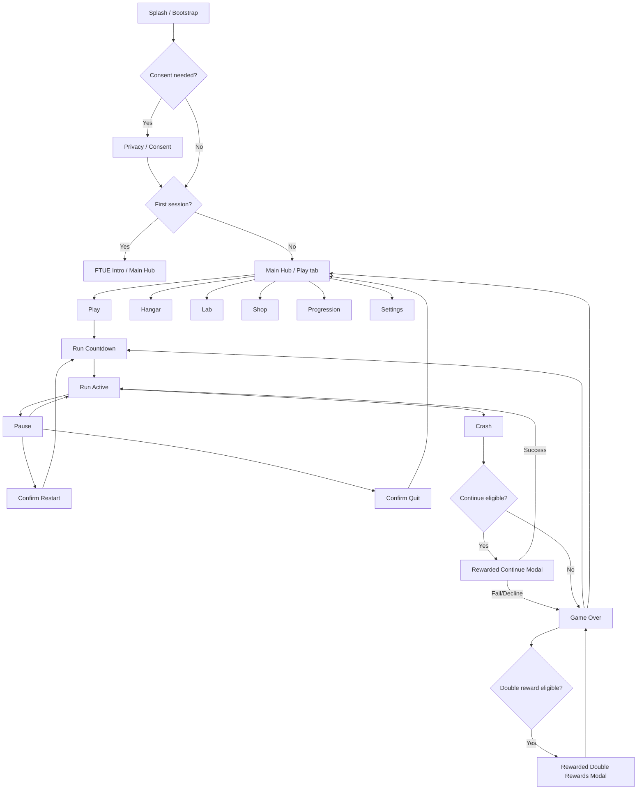

# Core Racer Navigation and Modal Flow

This document defines the final first-release navigation model.

## Navigation states

```text
Bootstrap
HubShell.Play
HubShell.Hangar
HubShell.Lab
HubShell.Shop
HubShell.Progression
Settings
PrivacyConsent
Run.Countdown
Run.Active
Run.Paused
Run.Crashed
Run.GameOver
DevDebug
```

`HubShell.*` states share the same top bar and bottom navigation. Run states do not use bottom navigation.

## Navigation map



## Back behaviour

### Android back button / escape key

| Current state | Behaviour |
| --- | --- |
| Splash / Bootstrap | Ignore unless in error state. |
| Privacy / Consent | Block exit if consent is legally required; otherwise return to previous safe screen. |
| Main Hub / Play tab | Optional quit app confirmation on Android only. |
| Hangar / Lab / Shop / Progression | Return to Play tab. |
| Settings | Return to previous menu tab. |
| Run Countdown | Pause or confirm quit, depending on implementation simplicity. |
| Run Active | Pause. |
| Pause | Resume. |
| Crash / Continue Offer | Move to Game Over or close modal if safe. |
| Game Over | Return to Hub / Play tab. |
| Modal | Close only if the action is cancellable. |

## Modal stack rules

- Only one modal should be open at a time.
- A modal must block bottom navigation unless it is purely informational and dismissible.
- A purchase/ad modal must not be opened twice from rapid tapping.
- Destructive confirmations must clearly name the action.
- If an async modal fails, the player must be left in a recoverable state.

## Notification badge rules

Use badges sparingly:

| Destination | Badge source |
| --- | --- |
| Hangar | Newly unlocked/equippable cosmetics only. |
| Lab | Affordable useful upgrades only. |
| Shop | Restore/purchase attention only when relevant; avoid noisy monetisation badges. |
| Progression | Claimable daily/task/milestone rewards. |
| Settings | Privacy/consent/support issue only. |

The Play tab should not get a badge. Play is the default action.

## Run entry flow

1. Player taps Play from hub or Play tab.
2. Play screen shows route/ship summary.
3. Player taps Start Run.
4. Bottom nav is hidden.
5. Countdown starts.
6. Input is ignored until countdown completes.
7. Run HUD becomes active.

## Run exit flow

### Normal crash without continue

1. Fatal hit occurs.
2. Run progression freezes.
3. Crash reason/feedback appears.
4. If no continue is available, Game Over opens.
5. Rewards are committed once.
6. Player can replay or return to hub.

### Crash with continue

1. Fatal hit occurs.
2. Run progression freezes.
3. Continue offer appears only if eligible.
4. Successful rewarded callback resumes run from safe state.
5. Failed/declined ad moves to Game Over.
6. Continue is capped and cannot be abused in one run.

### Pause quit

1. Player pauses.
2. Player taps Quit.
3. Confirm Destructive Action Modal appears.
4. Confirm returns to hub without granting normal completion rewards unless design explicitly allows partial rewards.

## Deep-link / external return handling

When returning from an ad, IAP purchase, privacy browser, or app suspend:

- Restore the last safe navigation state.
- Do not start/resume a run until services report a valid result or timeout recovery state.
- Do not duplicate rewards if the app is backgrounded during a reward/purchase callback.
