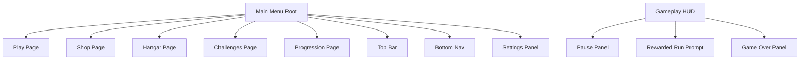

# Screen Feature Breakdown

This is the screen map I expect from the current repo, based on scene objects, UI scripts, and scene wiring. It also includes a confirmation checklist so you can tell me what is actually present in the built scene and what is still missing, placeholder, or broken.

## Screen Map

## What Looks Present In Code

### Main menu shell

- `MainMenuController` switches between:
  - Shop
  - Hangar
  - Play
  - Challenges
  - Progression

### Top bar

- `TopBarController` expects:
  - player level
  - XP bar
  - soft currency
  - premium currency
- Clicking either currency should open Shop > Currency.

### Bottom navigation

- `BottomNavBarController` expects page buttons with selected and locked states.
- Shop is level-locked until level `2`.
- Hangar is level-locked until level `3`.

### Play page

- `MainMenuUI` expects:
  - best score text
  - level selection arrows
  - level name
  - optional shape image
  - play button
  - settings button
  - remove ads button
  - restore purchases button
  - premium badge
  - optional thank-you popup

### Hangar page

- `HangarPageController` expects tabs for:
  - Upgrades
  - Skins
  - Trails
  - Core FX
- It also expects:
  - ship stat rows
  - dynamic content container
  - upgrade item prefab
  - cosmetic item prefab

### Shop page

- `ShopPageController` expects tabs for:
  - Skins
  - Ships
  - Trails
  - Currency
- It also expects:
  - content container
  - item card prefab
  - details modal

### Progression page

- `ProgressionTasksHubView` expects tabs for:
  - Daily
  - Weekly
  - Monthly
- `ProgressionTasksController` expects:
  - progress value text
  - timer text
  - reward row
  - task list
- Daily tab may auto-create a daily login preview block if missing.

### Challenges page

- `MainMenuController` has a `challengesPage` slot.
- I did not find a dedicated controller script for a challenges-specific page in the scanned files.
- This may be a placeholder page, a static layout, or an unimplemented future page.

### Settings panel

- `SettingsMenuUI` expects:
  - music toggle
  - SFX toggle
  - vibrate toggle
- It also supports touch input mode changes.
- Sensitivity sliders are commented out in code.

### Gameplay HUD

- `HudController` expects:
  - live score
  - best score
  - combo multiplier
  - elapsed time
  - health slider
  - speed text
  - pause button
  - powerup indicators
  - pickup score popup container

### Pause panel

- `PauseMenuUI` expects:
  - resume button
  - menu button
  - optional settings button/panel

### Game over panel

- `GameOverUI` expects:
  - final score
  - best score
  - elapsed time
  - continues used
  - continues remaining
  - continue button
  - double rewards button
  - restart button
  - menu button

### Rewarded prompt overlay

- `RewardedRunPromptUI` exists as `Assets/Resources/UI/RewardedRunPrompt.prefab`
- Current code has the trigger logic mostly disabled in `GameManager`:
  - `ShouldTriggerRewardedRunPrompt()` exists
  - the update call is commented out
- Result: the UI asset exists, but the feature may not currently surface during a run.

### Other observed scene objects

From `Assets/Scenes/GameScene.unity`, I found names that strongly suggest these objects exist:

- `MainMenuPanel`
- `PausePanel`
- `GameOverPanel`
- `SettingsPanel`
- `PauseButton`
- multiple `SettingsButton` and `MenuButton` objects

## Expected Screen Breakdown

| Screen / Overlay | Expected Feature Set | Confidence |
| --- | --- | --- |
| Main Menu shell | multi-page root, page transitions, nav state | High |
| Play page | best score, level select, play CTA, ads CTA, settings | High |
| Top bar | level, XP, currencies, shop shortcut | Medium |
| Shop page | tabbed item list and purchase modal | Medium |
| Hangar page | upgrades, cosmetics, equip flow, stats | Medium |
| Progression page | daily/weekly/monthly tasks, rewards, daily login preview | High |
| Challenges page | unknown content, page likely exists | Low |
| Settings panel | audio/vibration/input toggles | High |
| HUD | score, combo, health, time, speed, powerups | High |
| Pause panel | resume, menu, settings | High |
| Game Over panel | continue, double rewards, restart, menu | High |
| Rewarded run prompt | prefab exists, trigger likely disabled | Medium |
| Remove Ads thank-you popup | script exists, likely tied to purchase flow | Medium |

## High-Risk Gaps I Expect

- Shop data may be missing because no `ShopDatabase.asset` was found.
- Hangar content may render empty because `ShipDatabase.asset` is empty.
- Powerup upgrade rows may render empty because `PowerupUpgradeConfig.asset` is empty.
- Daily login preview may show unavailable if no `DailyLoginRewardsConfig` asset is wired.
- Challenges page may be an empty or placeholder container.
- Rewarded run prompt likely does not appear during gameplay right now.

## Confirmation Checklist

Reply with `Yes`, `No`, or `Partial` for each item, plus notes where useful.

### Main menu shell

- Main menu opens on the Play page by default.
- Bottom nav exists and can switch pages.
- Shop and Hangar are actually locked by player level.
- Page transitions animate left/right.

### Play page

- Best score is visible.
- Level left/right arrows are visible.
- Level shape image is visible.
- Play button starts the run.
- Remove Ads button is visible for non-premium users.
- Restore purchases button is visible and behaves correctly.
- Premium badge appears after purchase.

### Top bar

- Player level is visible.
- XP progress bar is visible.
- Soft currency is visible.
- Premium currency is visible.
- Tapping currency opens the shop currency tab.

### Shop

- Shop page exists visually.
- Shop has tabs for skins, ships, trails, currency.
- Items actually populate in at least one tab.
- Tapping an item opens a modal.
- Purchasing an item unlocks it.

### Hangar

- Hangar page exists visually.
- Upgrades tab shows rows.
- Skins tab shows rows.
- Trails tab shows rows.
- Core FX tab shows rows.
- Equipping cosmetics works.
- Ship stats update when appropriate.

### Progression

- Progression page exists visually.
- Daily tab shows tasks.
- Weekly tab shows tasks.
- Monthly tab shows tasks.
- Reward milestone nodes are visible.
- Daily login preview is visible.
- Daily login can actually be claimed.

### Challenges

- A separate Challenges page exists.
- It has real content and not just a placeholder panel.
- It is different from the Progression page.

### Settings

- Settings can open from the main menu.
- Settings can open from pause.
- Music toggle works.
- SFX toggle works.
- Vibrate toggle works.
- Touch input mode toggle exists and works.

### Gameplay HUD

- Score is visible during runs.
- Combo is visible during runs.
- Health bar is visible.
- Time is visible.
- Speed value is visible.
- Active powerups display with timers.
- Pickup score popups animate toward the score area.

### Pause / Game Over / Ads

- Pause overlay appears during a run.
- Resume works.
- Return to menu from pause works.
- Game over screen appears on death.
- Continue button appears when continues remain.
- Continue via rewarded ad works.
- Double rewards button appears when eligible.
- Double rewards ad flow works.
- Interstitials appear when expected.

### Misc

- Remove Ads thank-you popup appears after successful purchase.
- Rewarded run prompt ever appears during gameplay.
- Daily login rewards are configured in your local scene/assets.
- There is a local `ShopDatabase.asset` not committed yet.
- There is a local `DailyLoginRewardsConfig` asset not committed yet.

## Fastest Things For You To Tell Me Next

If you want the fastest handoff, tell me these first:

1. Which pages are visually present right now: Play, Shop, Hangar, Challenges, Progression.
2. Whether Shop actually has authored items.
3. Whether Hangar actually has authored upgrades/cosmetics.
4. Whether Daily Login is real or only planned.
5. Whether Challenges is a real feature or just a placeholder tab.

